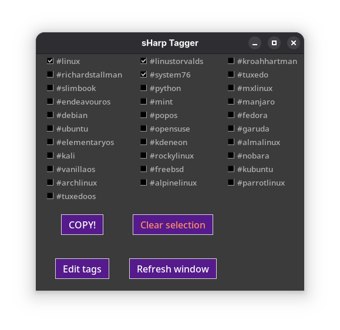

# sHarp Tagger

A simple GUI tag selector that copies selected tags to clipboard.

## Features

- Select multiple tags via checkboxes
- Copy selected tags to clipboard
- Edit tags in external text editor
- Auto-check tags ending with `+` or `*`
- Configurable column layout

## Requirements

- Python 3.x with tkinter
- `tags.txt` file with one tag per line
- `config.ini` with `[Options]` section and `columns_number` setting
- `icon.png` for window icon

## Usage

Run `python main.py` to open the tag selector window.

## Files

- `tags.txt` - List of available tags (one per line)
- `config.ini` - Configuration file for column layout
- `icon.png` - Window icon